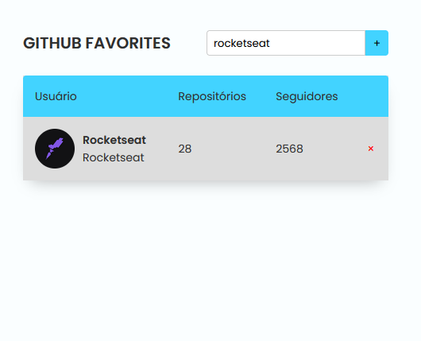

<h1 align="center">Github Favorites</h1>

  <a href="#-tecnologias">Tecnologias</a>&nbsp;&nbsp;&nbsp;|&nbsp;&nbsp;&nbsp;
  <a href="#-projeto">Projeto</a>

 

  

## 🚀 Tecnologias

Esse projeto foi desenvolvido com as seguintes tecnologias:

- Javascript
- HTML e CSS
- Git e Github

## 💻 Projeto

Este projeto foi desenvolvido em aula do Stage 06: JavaScript antes do Framework, do curso Explorer da Rocketseat.
Este Stage teve como objetivo aprendizado de diversos conhecimentos de JavaScript, como:

- Princípios de Orientação a Objetos
- onsumo de API
- Classes
- Promises e async/await
- tratamento de erros com try, catch e throw
- localStorage
- Métodos confirm(), filter(), find(), JSON.parse() e JSON.stringify()
- Spread Operator
- Criação de tabelas com HTML

Além de inúmeros conhecimentos de CSS.

### Você pode visualizar o projeto através [DESSE LINK](https://viviansanchez.github.io/rocketseat-explorer-stage06-projeto02/)!
